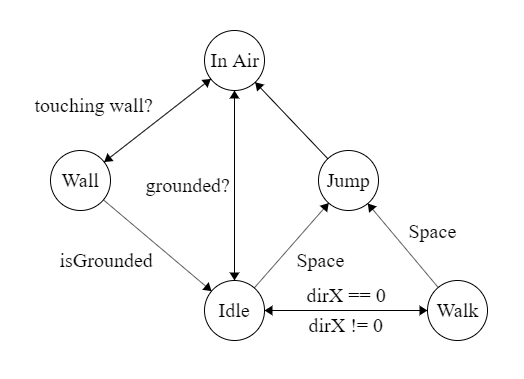

# Waterfall Warrior


## Background and Overview
Waterfall Warrior is a game where the goal of the player is to jump on falling platforms and get as high as possible. Falling platforms will follow a semi-random pattern to prevent each attempt from being exactly the same as the last. Players will be scored based on maximum height reached and time survived.

#### Basic Controls
- Left and Right arrow keys to move
- Space to jump

## Features
 - Robust movement: In addition to basic ground movement and jumping, the player is able to double jump, wallslide, and walljump.
 - Infinite scrolling: The player can progress as long as they want through a random sequence of falling platforms
 - Score tracking: The top 10 scores of the player are stored locally so they can viewed and challenged again at a later date
 - Mobile support: Touch controls are available on mobile in the form of a virtual joystick for movement and jump button.

 ### URL QR Code
 

## Architecture and Technologies
 - Vanilla JavaScript for game logic
 - HTML5 Canvas for rendering
 - HTML5 audio player for SFX and BGM

## Implementation Highlights

#### Movement State Machine
The input processing logic for *Waterfall Warrior* is encapsulated across several player states. These are the currently implemented states followed by a simplified state diagram:

```javascript
const PlayerState = {};

PlayerState.IDLE = new IdleState();
PlayerState.WALKING = new WalkingState();
PlayerState.RISING = new RisingState();
PlayerState.FALLING = new FallingState();
PlayerState.JUMPING = new JumpingState();
PlayerState.ROLLING = new RollingState();
PlayerState.WALLSLIDING = new WallslidingState();

export default PlayerState;
```



Each state contains logic for handing input and transitioning to the next state. Here is the `handleInput` method for `GroundState` which `IdleState` and `WalkingState` extend from:

```javascript
handleInput(controller, inputFlags) {
    if (!controller.isGrounded()) {
        return PlayerState.FALLING;
    }

    if (inputFlags.jumpPressed) {
        return PlayerState.JUMPING;
    }

    if (inputFlags.dirX !== 0) {
        return PlayerState.WALKING;
    }

    return PlayerState.IDLE;
}
```

Once state transitions are handled, the `handleUpdate` method of the current state is invoked to determine how the `PlayerController` should move the player. This is how the `WallslidingState` handles the various actions the player can perform while on the side of a falling platform:

```javascript
handleUpdate(controller, inputFlags) {
    let action = WallSlideAction.None;
    let jump = inputFlags.jumpPressed && inputFlags.newJump;
    
    if (jump && inputFlags.dirX === -controller.wallDirection()) {
        action = WallSlideAction.Leap;
    } else if (jump && inputFlags.dirX === controller.wallDirection()) {
        action = WallSlideAction.Climb;
    } else if (jump) {
        action = WallSlideAction.Drop;
    }

    controller.wallAction(inputFlags, action);
}
```

This movement state setup results in a very simple `move()` function in the `Player` class:

```javascript
move() {
    // get current inputs
    const inputFlags = this.inputManager.inputFlags;

    // update state based on current inputs
    this.currentState = this.currentState.handleInput(this.controller, inputFlags);

    // process state with current inputs
    this.currentState.handleUpdate(this.controller, inputFlags);

    // move player with controller
    this.controller.move();

    // update animation
    this.updateAnimation(inputFlags.dirX);

    // check game over
    if (this.game.isOffScreen(this.pos.y, this.size.y) || 
        this.controller.gotSquished()) {
        this.dead();
    }
}
```